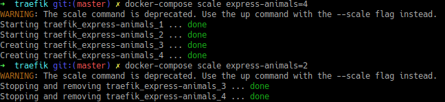

# Dynamic cluster management

## Traefik
We use Traefik for load balancing. It can do cluster management too :

As you can see, we can change the scale (number of container of an image) on the fly.
