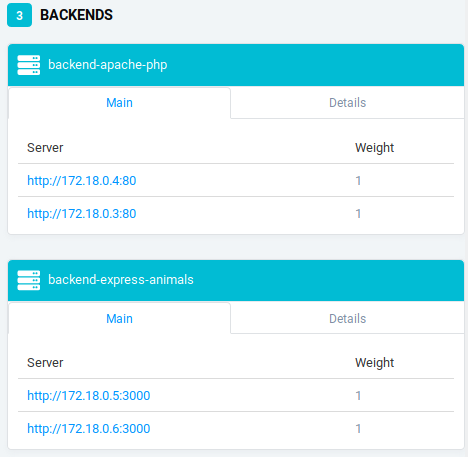
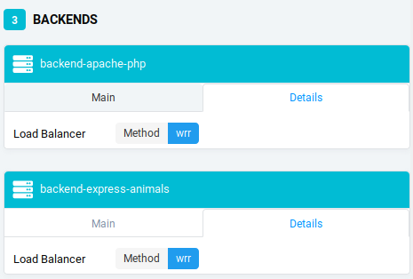

# Load balancing : multiple server nodes

## Traefik
We use Traefik as a reverse proxy that manage load balancing for us.

To run Traefik, first go to /docker-images/traefik then :

```sh
docker-compose up -d reverse-proxy 
```

Now we can see load balancing at work by running multiple instances of apache_php :

```sh
docker-compose scale apache-php=2
```

multiple instances of express-animals :

```sh
docker-compose scale express-animals=2
```

You can see below that multiple instances have been run and that load balancing is enabled :

\

\


