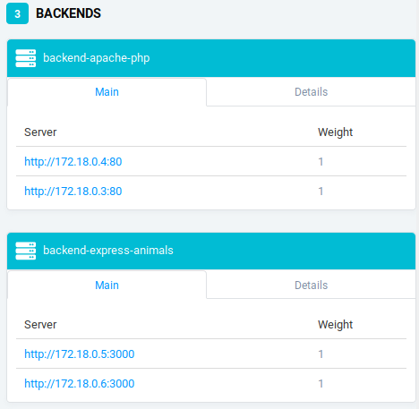
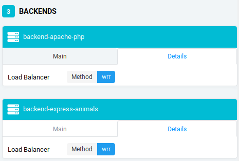

# Load balancing : multiple server nodes

## Traefik
We use Traefik as a reverse proxy that manage load balancing for us.

To run Traefik, first go to /docker-images/traefik then :

```sh
docker-compose up -d reverse-proxy 
```

Now we can see load balancing at work by running multiple instances of apache_php :

```sh
docker-compose scale apache-php=2
```

multiple instances of express-animals :

```sh
docker-compose scale express-animals=2
```

You can see below that multiple instances have been run and that load balancing is enabled :





## Configuration
Configuration is stored in docker-images/traefik/docker-compose.yml

Our docker images are services with their configuration :

```sh
  apache-php:
    image: res/apache_php
    labels:
      - "traefik.backend=apache-php"
      - "traefik.frontend.rule=Host:demo.res.ch"
      - "traefik.port=80"
  express-animals:
    image: res/express_animals
    labels:
      - "traefik.backend=express-animals"
      - "traefik.frontend.rule=Host:demo.res.ch; PathPrefixStrip:/api/animals/"
      - "traefik.port=3000"
```

We can see that we kept with demo.res.ch as host, port 80 for the static apache container and port 3000 with path /api/animals for the express container.
